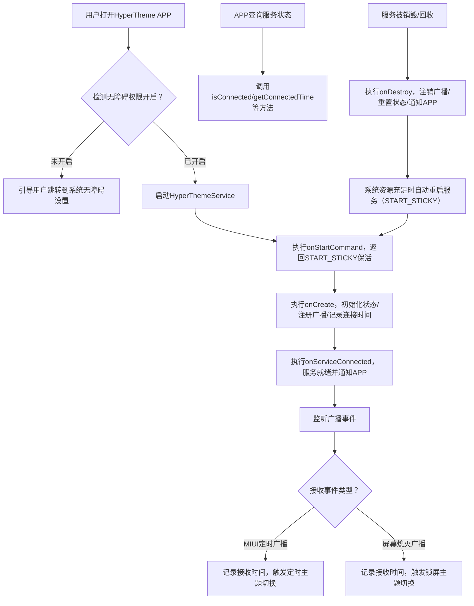

# HyperThemeService 服务生命周期流程图

## 完整流程



## 详细说明

### 一、服务启动阶段

#### 1. 用户打开 APP
- APP 启动后，检查无障碍权限状态
- 通过 `AccessibilityManager` 查询服务是否已启用

#### 2. 权限检查
```kotlin
fun isAccessibilityServiceEnabled(context: Context): Boolean {
    val accessibilityEnabled = Settings.Secure.getInt(
        context.contentResolver,
        Settings.Secure.ACCESSIBILITY_ENABLED
    )
    if (accessibilityEnabled == 1) {
        val services = Settings.Secure.getString(
            context.contentResolver,
            Settings.Secure.ENABLED_ACCESSIBILITY_SERVICES
        )
        return services?.contains("ThemeInstallAccessibilityService") == true
    }
    return false
}
```

#### 3. onStartCommand
```kotlin
override fun onStartCommand(intent: Intent?, flags: Int, startId: Int): Int {
    return Service.START_STICKY  // 保活机制
}
```
- **返回值**: `START_STICKY` (值=1)
- **作用**: 服务被系统回收后自动重启

#### 4. onCreate
```kotlin
override fun onCreate() {
    // 1. 校验 isConnected（避免重复初始化）
    if (isConnected) return
    
    // 2. 发送状态广播："服务开始创建"
    sendServiceStatusBroadcast("服务开始创建")
    
    // 3. 记录连接时间
    st_connectedTime = TIME_FORMAT.format(Date())
    
    // 4. 注册广播接收器
    registerBroadcastReceiver()
    
    // 5. 标记服务已连接
    isConnected = true
}
```

#### 5. onServiceConnected
```kotlin
override fun onServiceConnected() {
    // 1. 配置无障碍服务
    configureAccessibilityService()
    
    // 2. 发送状态广播："服务已完全就绪"
    sendServiceStatusBroadcast("服务已完全就绪")
}
```

---

### 二、事件监听阶段

#### 6. 广播接收器监听
```kotlin
private val mBroadcastReceiver = object : BroadcastReceiver() {
    override fun onReceive(context: Context?, intent: Intent?) {
        val action = intent?.action
        st_receiveTime = TIME_FORMAT.format(Date())
        
        when (action) {
            ALARM_ACTION -> handleAlarmBroadcast()      // MIUI 定时
            SCREEN_OFF_ACTION -> handleScreenOffBroadcast()  // 系统熄屏
        }
    }
}
```

#### 7. 场景1: MIUI 定时广播
```kotlin
private fun handleAlarmBroadcast(context: Context, timestamp: Long) {
    // 1. 记录接收时间
    alarmReceiveCount++
    
    // 2. 设置标记
    isApplyUserTheme = true
    
    // 3. 检查主题文件
    val themeFile = ThemeInstaller.getThemeInstallFile()
    
    // 4. 启动主题管理器
    if (themeFile.exists()) {
        ThemeInstaller.applyTheme(context)
    }
    
    // 5. 记录日志
    LogManager.log(...)
}
```

#### 8. 场景2: 屏幕熄灭广播
```kotlin
private fun handleScreenOffBroadcast(context: Context, timestamp: Long) {
    // 触发锁屏主题切换逻辑
    screenOffCount++
}
```

---

### 三、外部状态查询

#### 9. APP 查询服务状态
```kotlin
companion object {
    fun isConnected(): Boolean = isConnected
    fun getConnectedTime(): String = st_connectedTime
    fun getReceiveTime(): String = st_receiveTime
}
```

**使用方式**:
```kotlin
// 在 APP 中查询
if (ThemeInstallAccessibilityService.isConnected()) {
    val time = ThemeInstallAccessibilityService.getConnectedTime()
    // 显示: "服务运行中，连接时间: 2025/10/14 02:45:33"
}
```

---

### 四、服务销毁阶段

#### 10. onDestroy
```kotlin
override fun onDestroy() {
    // 1. 校验连接状态
    if (isConnected) {
        // 2. 注销广播接收器
        unregisterBroadcastReceiver()
        
        // 3. 重置状态
        isConnected = false
        
        // 4. 发送状态广播："服务已销毁"
        sendServiceStatusBroadcast("服务已销毁")
    }
    
    // 5. 释放资源
    serviceScope.cancel()
}
```

#### 11. onTaskRemoved
```kotlin
override fun onTaskRemoved(rootIntent: Intent?) {
    // 用户在最近任务中划掉 APP
    // 系统会触发 onDestroy
}
```

#### 12. START_STICKY 自动重启
```
服务被系统回收
    ↓
系统资源充足
    ↓
自动重启服务
    ↓
重新执行 onStartCommand → onCreate → onServiceConnected
```

---

## 状态广播通知

### 服务状态广播 Action
```kotlin
private const val ACTION_SERVICE_UP = "io.vi.hypertheme.action_Service_UP"
```

### 发送时机

| 时机 | 状态 | Extra 数据 |
|------|------|-----------|
| onCreate | "服务开始创建" | status, connectedTime, isConnected |
| onServiceConnected | "服务已完全就绪" | status, connectedTime, isConnected |
| onDestroy | "服务已销毁" | status, connectedTime, isConnected |

### APP 接收广播
```kotlin
private val serviceReceiver = object : BroadcastReceiver() {
    override fun onReceive(context: Context?, intent: Intent?) {
        val status = intent?.getStringExtra("status")
        val connectedTime = intent?.getStringExtra("connectedTime")
        val isConnected = intent?.getBooleanExtra("isConnected", false)
        
        // 更新 UI 显示服务状态
        when (status) {
            "服务开始创建" -> showStatus("初始化中...")
            "服务已完全就绪" -> showStatus("运行中")
            "服务已销毁" -> showStatus("已停止")
        }
    }
}

// 注册接收器
val filter = IntentFilter("io.vi.hypertheme.action_Service_UP")
registerReceiver(serviceReceiver, filter)
```

---

## 时间格式

```kotlin
private val TIME_FORMAT = SimpleDateFormat("yyyy/MM/dd HH:mm:ss", Locale.getDefault())

// 示例输出
st_connectedTime = "2025/10/14 02:45:33"
st_receiveTime = "2025/10/14 02:46:15"
```

---

## 完整生命周期示例

```
[用户操作]
打开 APP → 检查权限 → 启用无障碍服务

[服务启动]
onStartCommand (返回 START_STICKY)
    ↓
onCreate
    - 发送广播: "服务开始创建"
    - 记录时间: 2025/10/14 02:45:33
    - 注册接收器
    - isConnected = true
    ↓
onServiceConnected
    - 配置服务
    - 发送广播: "服务已完全就绪"

[运行中]
监听广播 → MIUI 定时广播触发
    - 记录时间: 2025/10/14 03:00:00
    - 检查主题文件
    - 启动主题管理器
    - 记录日志

[服务销毁]
onDestroy
    - 注销接收器
    - isConnected = false
    - 发送广播: "服务已销毁"
    - 释放资源

[自动重启]
系统资源充足 → 重新执行 onStartCommand → onCreate → ...
```


